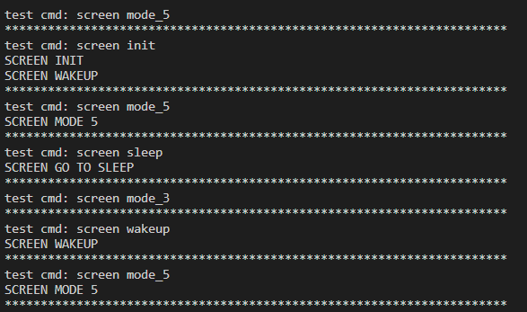
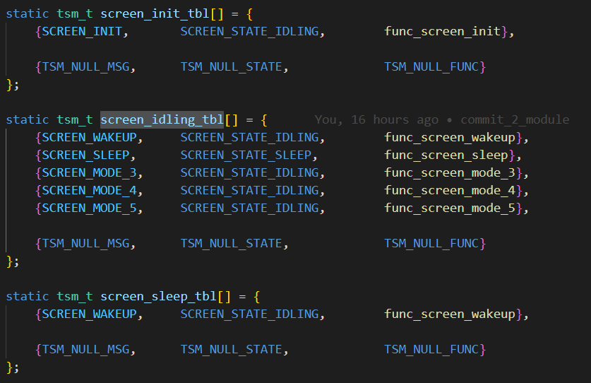
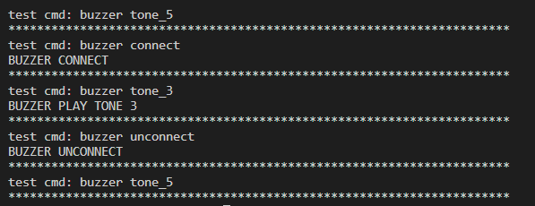
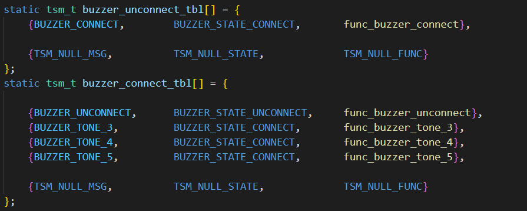
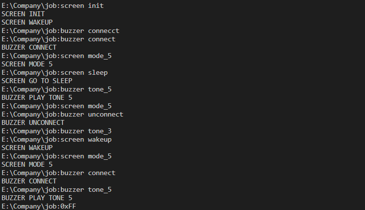

                                                STATE MACHINE
    
    Ở ví dụ này ta sẽ có một màn hình gồm các trạng thái init (khởi  động màn hình và bước vào trạng thái wakeup). Ở trạng thái wakeup bạn sẽ có các chế độ là sleep (bước vào trạng thái màn hình nghỉ), mode_3 ( hiển thị màn hình mode_3), mode_4 (hiển thị màn hình mode_4), mode_5 (hiển thị màn hình mode_5). Khi ở trạng thái sleep thì màn hình sẽ không thực hiện được các mode_3, mode_4, mode_5, chúng ta chỉ thực hiện được các chế độ đó khi ở trạng thái wakeup. Ở đây ta sẽ sử dụng các lệnh cmd để thực hiện ví dụ này. Dưới đây là hình ảnh ví dụ về State Machine của màn hình.

    
    Đây là bảng trạng thái của màn hình.

    Và sau đây là ví dụ khác về State Machine của buzzer. 

    Đây là bảng trạng thái của buzzer.

    
    Và ở đây chúng ta sẽ kết hợp cả hai.

    Các lệnh để điều khiển các trạng thái bao gồm:

    screen init (khởi động màn hình và vào trạng thái wakeup).
    screen wakeup   :       wakeup màn hình khi ở trạng thái sleep.
    screen sleep    :       sleep màn hình khi ở trạng thái wakeup.
    screen mode_3   :       hiển thị màn hình ở mode 3.
    screen mode_4   :       hiển thị màn hình ở mode 4.
    screen mode_5   :       hiển thị màn hình ở mode 5.

    buzzer connect  :       kết nối với buzzer.
    buzzer unconnect:       ngắt kết nối với buzzer.
    buzzer tone_3   :       phát nhạc tone 3.
    buzzer tone_4   :       phát nhạc tone 4.
    buzzer tone_5   :       phát nhạc tone 5.